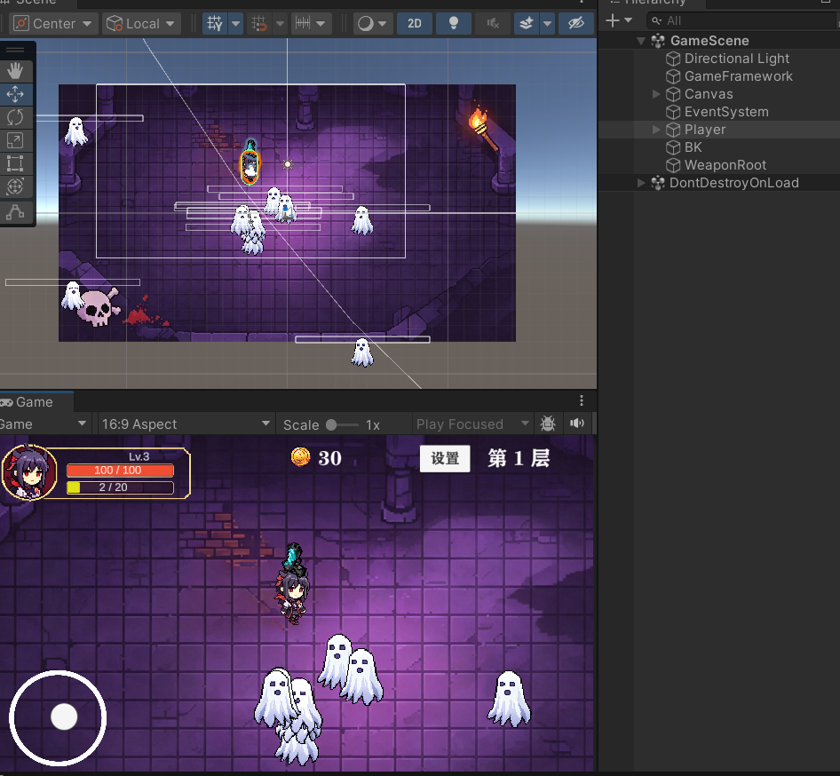
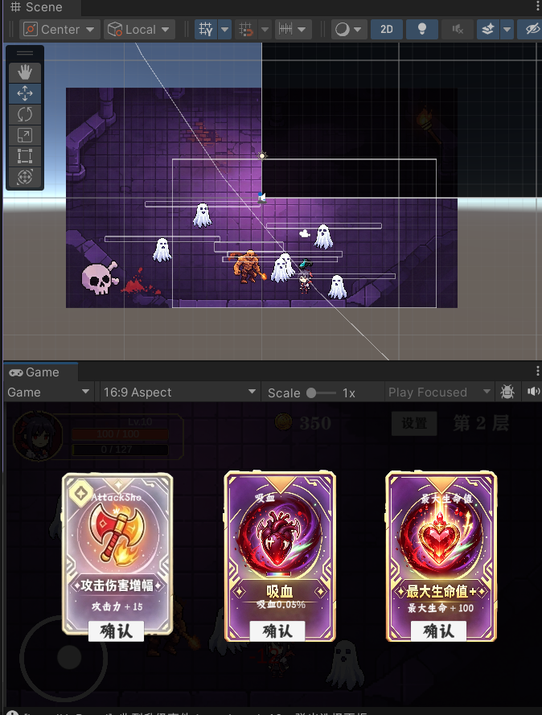
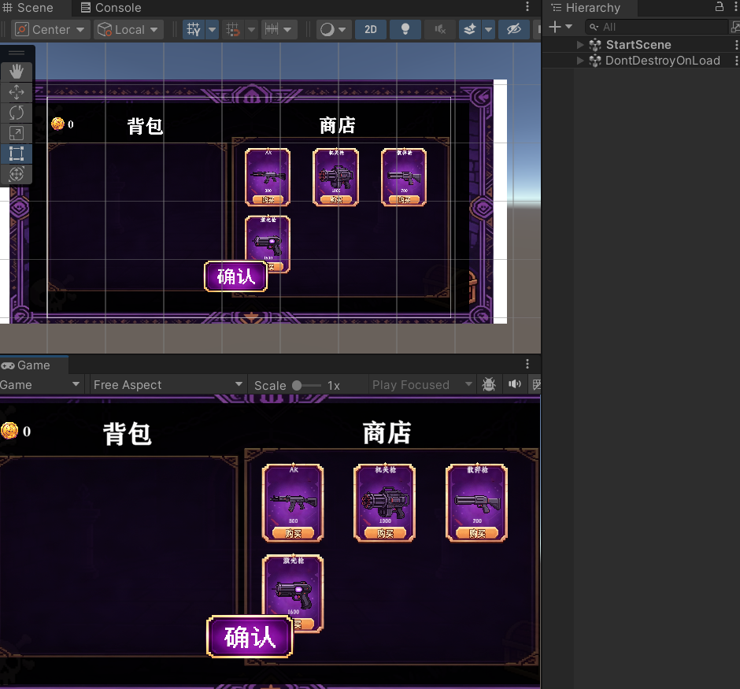
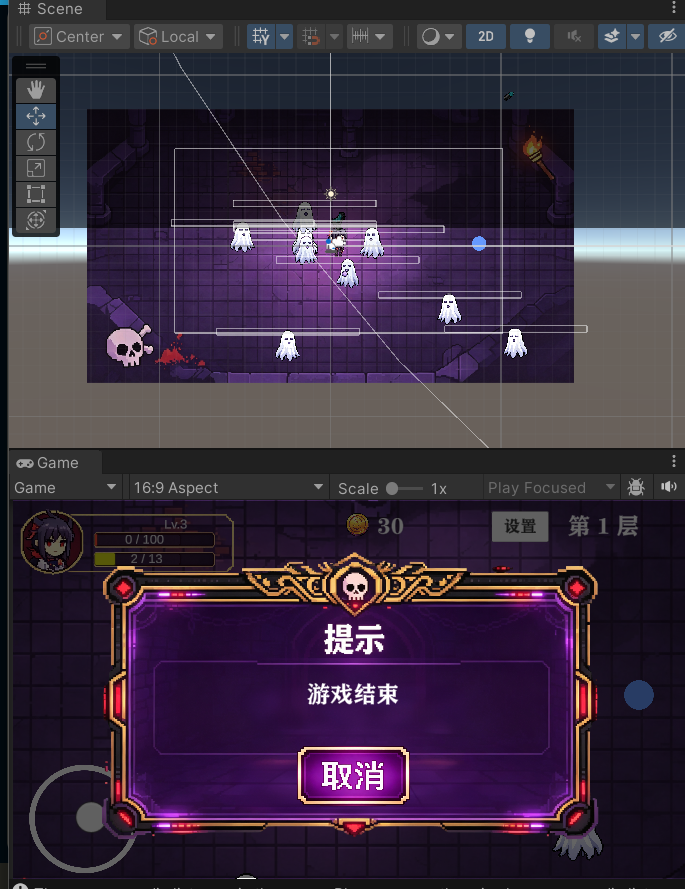

# 2D 割草肉鸽游戏（Survivor-like）

> 一款基于团结引擎开发的 2D 俯视角割草肉鸽游戏，支持微信小游戏平台。玩家在不断涌来的怪物潮中生存，通过拾取经验球升级，随机选择强化道具构建 Build。

---

## 📱 扫码试玩

<div align="center">

<p>微信扫码即可体验游戏</p>
</div>

---

## 🎮 游戏画面

<div align="center">

<p>战斗主画面 —— 玩家对抗怪物潮</p>
</div>

<div align="center">

<p>升级强化系统 —— Roguelike 三选一 Build</p>
</div>

<div align="center">

<p>商店与背包系统 —— 武器购买与装备</p>
</div>

<div align="center">

<p>游戏结束 —— 完整游戏循环</p>
</div>

---

## 技术栈

| 领域 | 技术方案 |
|------|----------|
| 引擎 | 团结引擎（Unity 2022.3 LTS 定制版） |
| 渲染管线 | URP (Universal Render Pipeline) |
| 语言 | C# |
| 资源管理 | Addressables + Unity CCD (Cloud Content Delivery) |
| 输入系统 | Unity Input System（虚拟摇杆 + 键鼠双端） |
| 资源热更 | Addressables + Unity CCD 远程资源更新 |
| 目标平台 | 微信小游戏 |

---

## 架构设计

### 整体分层

```
┌─────────────────────────────────────────┐
│           C# 业务逻辑层                   │
│  武器系统 / 怪物 AI / 经验强化 / 商店背包  │
├─────────────────────────────────────────┤
│           C# 核心框架层                   │
│  GameManager / EventBus / 对象池 / FSM   │
├─────────────────────────────────────────┤
│           C# 组件层（MonoBehaviour）      │
│  PlayerController / MonsterBase / Weapon  │
├─────────────────────────────────────────┤
│           资源与数据层                     │
│  Addressables / ScriptableObject / Save   │
└─────────────────────────────────────────┘
```

### 核心设计模式

- **单例模式**：`BaseMonoSingleton<T>` 泛型单例基类，所有 Manager 统一继承
- **事件总线（EventBus）**：严格泛型约束的 `EventBus`，通过 `IBaseEventArgs` 实现类型安全的解耦通信
- **对象池模式**：`PoolManager` + `ObjectPoolBase` + `IPoolable` 接口，统一管理子弹、经验球、伤害数字、怪物
- **有限状态机（FSM）**：怪物 AI 使用 `MonsterFsm`，所有状态继承 `MonsterBaseState` 抽象基类（追击 / 攻击 / 死亡）
- **组件化架构**：`GameManager` 拆分为 `GameFlowController` / `GameStateController` / `GameSaveSystem` 等组件
- **配置驱动**：武器、关卡、商店、背包数据均使用 ScriptableObject 配置

### 模块通信链路

```
玩家输入 → PlayerController → WeaponManager → 武器子类 → 对象池取子弹
                                              ↓
                                    EventBus 广播伤害事件
                                              ↓
                              MonsterBase 受血 → MonsterFsm 切换状态
                                              ↓
                              死亡 → 掉落 ExpOrb → PlayerExp 升级
                                              ↓
                              LevelUpPanel 弹出 → EnhanceSystem 随机强化
```

---

## 核心系统

### 1. 武器系统（5 种武器）

所有武器继承 `WeaponFireBase` 抽象基类，通过 `PlayerAutoWeapon` 统一调度自动攻击：

| 武器 | 特点 |
|------|------|
| 手枪 | 单发、中等射速 |
| 步枪 | 连发、高射速 |
| 霰弹枪 | 扇形多弹丸、近距离高伤 |
| 加特林 | 转速预热、极高射速 |
| 激光炮 | 穿透、高伤 |

### 2. 怪物 AI（FSM 状态机）

```
MonsterFsm
├── MonsterChaseState   （追击玩家）
├── MonsterAttackState  （进入攻击范围后触发，含冷却判定）
└── MonsterDeathState   （死亡动画 + 掉落 + 对象池回收）
```

- `DetectionComponent`：检测玩家距离
- `MovementComponent`：移动与朝向
- 血条 UI：`MonsterHpBar` 跟随世界坐标转屏幕

### 3. 经验与强化系统（Roguelike 核心）

- `ExpOrb`：怪物掉落，磁吸拾取
- `PlayerExp`：经验条管理，升级触发事件
- `EnhanceSystem`：随机生成 3 个强化选项（武器升级 / 属性提升 / 新武器解锁）
- `PlayerStatsChangedEventArgs`：属性变更通过 EventBus 同步到 UI

### 4. 波次生成系统

- `WaveSystem`：按时间递增怪物数量与种类
- `MonsterSpawner`：边界外生成，对象池复用
- 分层难度：不同波次解锁不同怪物类型

### 5. 商店与背包系统

- `BagAndStoreManager`：统一管理背包与商店
- ScriptableObject 配置物品数据
- 金币系统 `CoinManager`

### 6. UI 管理

- `UIManager`：面板栈管理（打开 / 关闭 / 回退）
- 面板：HUD / 升级面板 / 暂停面板 / 游戏结束 / 商店背包 / 开始界面
- 伤害数字飞字：`DamageNumberManager` 对象池管理

---

## 项目结构

```
Assets/
├── Script/                    # 核心代码（68 个 C# 脚本）
│   ├── Base/                  # 基类：单例、对象池基类、经验系统
│   ├── EventBus/              # 事件总线（泛型 + 类型安全参数）
│   ├── Manager/               # 管理器（Game/Audio/UI/Pool/Weapon...）
│   │   └── GameManagerComponents/  # GameManager 组件化拆分
│   ├── Player/                # 玩家控制器、血量、武器
│   │   └── Weapon/            # 5 种武器实现
│   ├── Monster/               # 怪物基类、生成器
│   ├── Anim/                  # 动画组件 + 怪物 FSM 状态
│   │   └── Monster/           # 怪物 FSM（Chase/Attack/Death）
│   ├── Exep/                  # 经验与强化系统
│   ├── UI/                    # UI 面板 + 虚拟摇杆
│   ├── StoreAndBag/           # 商店与背包
│   ├── Audio/                 # 音频管理
│   ├── Data/                  # 存档数据结构
│   ├── interface/             # 接口定义（IPoolable 等）
│   ├── SartSceneScript/       # 开场场景脚本
│   └── GameStartup.cs         # 启动流程（分步加载 + 权重配置）
├── Art/                       # 美术资源（角色/怪物/UI/字体）
├── Scenes/                    # 场景文件
├── Config/                    # ScriptableObject 配置（武器/关卡/商店/背包）
├── Resources/                 # 运行时加载资源（音频/配置/字体）
├── AddressableAssetsData/     # Addressables 分组配置
├── Editor/                    # 编辑器工具（一键分组、字体图集等）
├── Setting/                   # Input System 配置
├── Settings/                  # URP / Build Profiles
├── TextMesh Pro/              # TMP 资源
├── Video/                     # 视频资源
└── WX-WASM-SDK-V2/            # 微信小游戏 SDK
```

---

## 性能优化

| 优化点 | 方案 |
|--------|------|
| 对象池 | 子弹、经验球、伤害数字、怪物全部池化，避免 Instantiate/Destroy 开销 |
| 资源管理 | Addressables 按组加载，远程热更，杜绝 Resources 文件夹滥用 |
| 启动流程 | `GameStartup` 基于 `LoadingStepWeightConfig` 分步加载，EventBus 同步进度 |
| 渲染 | URP 2D Renderer，合批处理 |
| 物理 | `CompositeCollider2D` 边界约束，避免坐标硬 Clamp |
| 存档 | JSON 本地持久化，`SaveManager` 统一管理 |

---

## 资源热更新方案

1. **Addressables 分组管理**：资源按功能分组（Local_Base 等），通过编辑器工具一键初始化分组
2. **CCD 远程分发**：Unity Cloud Content Delivery 远程托管资源包，支持版本管理与灰度发布
3. **运行时加载**：`AddressablesManager` 统一管理资源的异步加载、缓存与释放
4. **一致性校验**：打包后真机与编辑器环境对比校验，确保资源加载行为一致

---

## 开发环境

- **引擎**：团结引擎（Unity 2022.3 LTS 定制版）
- **IDE**：Rider / Visual Studio
- **版本控制**：Git
- **目标平台**：微信小游戏 / Android

---

## 快速开始

1. 克隆仓库
2. 使用团结引擎打开项目
3. 打开 `Assets/Scenes/` 下的主场景
4. 点击 Play 运行

> 编辑器版本与微信小游戏体验版可能存在差异，以体验版为准。

---

*本项目为个人作品集项目，用于展示 Unity 客户端开发能力。*
